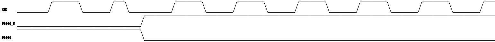

# Value Change Dump (VCD) File parser

[](https://github.com/filmil/go-vcd-parser/actions/workflows/test.yml)
[](https://github.com/filmil/go-vcd-parser/actions/workflows/release.yml)
[](https://pkg.go.dev/github.com/filmil/go-vcd-parser)

This is a parser for the Value Change Dump files, a.k.a VCD file format. The
file format is defined in the [IEEE Standard 1800-2003][vv]. Specifically, the
format supported at the moment is the 4-value format. Some pragmatic extensions
are supported, such as those produced by the `nvc` VHDL simulator.

The correct behavior of the parser is guarded by a suite of tests. Tests
include:
- Unit tests for specific VCD stanzas
- Unit tests for intersting VCD snippets encountered in the wild.
- Integration tests that parse realistic VCD files that were sampled from
  actual uses.

## Binaries

Each [release][rr] ships prebuilt static binaries for two programs, four
platforms each:

| Program | What it does |
|---|---|
| `vcdcvt` | Parses a VCD file and converts it to JSON or a SQLite signals database. |
| `sqlite2drawtiming` | Reads a SQLite signals database and writes [drawtiming](https://drawtiming.sourceforge.net/) input for selected signals to stdout. |

The platforms are `linux-amd64`, `linux-arm64`, `darwin-amd64` and
`darwin-arm64`. Download the file for your platform, make it executable, and
put it on your `PATH`:

```sh
curl -LO https://github.com/filmil/go-vcd-parser/releases/latest/download/vcdcvt-linux-amd64
chmod +x vcdcvt-linux-amd64
sudo mv vcdcvt-linux-amd64 /usr/local/bin/vcdcvt
```

`SHA256SUMS` in each release covers every file. On macOS, the first run may
need Gatekeeper approval: `xattr -d com.apple.quarantine <file>`.

Typical use:

```sh
# VCD to a SQLite signals database.
vcdcvt -in dump.vcd -format sqlite -out signals.db

# Selected signals from that database, as drawtiming input.
sqlite2drawtiming -in signals.db -signal clk -signal reset > timing.dt
```

### Worked example

This diagram comes from `vcd/files/samples/tb.vcd`, a UART testbench dump
in this repository, through the two tools and
[drawtiming](https://drawtiming.sourceforge.net/):

```sh
vcdcvt -in vcd/files/samples/tb.vcd -format sqlite -out tb.db

# `name=>alias` renames a signal for the output. Aliases keep the labels
# short, and drawtiming does not accept the slashes of the full paths.
# The timescale of this dump is 1 fs; -ndots 2500000 draws one time dot
# per 2.5 ns, and the window covers the first 40 ns.
sqlite2drawtiming -in tb.db -min-time 0 -max-time 40000000 -ndots 2500000 \
    -signal '//wb_uart_tb/clk=>clk' \
    -signal '//wb_uart_tb/reset=>reset' \
    -signal '//wb_uart_tb/clkgen/reset_n=>reset_n' \
    > timing.dt

drawtiming -o timing.png --cell-width 48 --cell-height 44 timing.dt
```



The clock runs from the start; at 10 ns `reset` deasserts and `reset_n`
rises with it.

Releases are cut on the fifth of each month when `fix:` or `feat:` commits
landed since the last tag, and on demand from the [Release workflow][ww].
The version number follows [semantic versioning][sv], computed from
[conventional commits][cc]. The binaries are cross-compiled with Bazel and a
[zig-based hermetic C toolchain][hh]; the build takes nothing from the host,
so a release is reproducible from its tag.

[rr]: https://github.com/filmil/go-vcd-parser/releases
[ww]: https://github.com/filmil/go-vcd-parser/actions/workflows/release.yml
[sv]: https://semver.org/
[cc]: https://www.conventionalcommits.org/en/v1.0.0/
[hh]: https://github.com/uber/hermetic_cc_toolchain

## Why?

- **I wanted one written in go** (compiled, static, well-tested). Most open source
  alternatives I could find are written in Python, Perl and C++ (see the
  References section below).
- **I wanted one that is *tested***. Most alternatives contain no tests at all. Some
  that I have actually tried would just throw an exception when faced with a
  realistic VCD file.
- **I needed a confirmation that the code can parse realistic VCD files.** Hence,
  the test coverage. And samples of realistic VCD files used for testing.

## Go documentation

API documentation for every package is on [pkg.go.dev][pd]:

| Package | What it holds |
|---|---|
| [`vcd`](https://pkg.go.dev/github.com/filmil/go-vcd-parser/vcd) | The VCD lexer and parser; parsing produces a `vcd.File`. |
| [`cvt`](https://pkg.go.dev/github.com/filmil/go-vcd-parser/cvt) | Conversions of the parsed representation. |
| [`db`](https://pkg.go.dev/github.com/filmil/go-vcd-parser/db) | The SQLite signal database: schema, writers, readers. |
| [`dbq`](https://pkg.go.dev/github.com/filmil/go-vcd-parser/dbq) | The query engine over a signal database: transition lookups, values at a timestamp, timing assertions for tests. |
| [`dbt`](https://pkg.go.dev/github.com/filmil/go-vcd-parser/dbt) | Test helpers that build small signal databases in memory. |

[pd]: https://pkg.go.dev/github.com/filmil/go-vcd-parser

## Prerequisites

* Install `bazel` using the [bazelisk method][ii].

  It should be possible to use the vanilla go environment as well.

## Test

From the root directory, run:

```
bazel test //...
```

This should always pass. [Report a bug][bb] if not.


If you have `go` installed, you can also run:

```
go test ./...
```

While this should pass, I will not necessarily spend time to make it work
with the go toolkit.

## Limitations

- The parser is not streaming. It produces an in-memory representation of the
  VCD file before it is able to write a parsed representation out. As VCD files
  can get extraordinarily large, you may find that some realistic large files
  can not be parsed with success.

## Troubleshooting

If you find a problem VCD file, file a bug report and consider sending the file.
Minimal examples are preferred.

# References

Prior art:

- https://github.com/ben-marshall/verilog-vcd-parser
- https://wohali.github.io/vcd_parsealyze
- https://github.com/kmurray/libvcdparse
- https://pypi.org/project/pyDigitalWaveTools
- https://metacpan.org/pod/Verilog::VCD
- https://pyvcd.readthedocs.io/en/latest/vcd.reader.html
- https://pypi.org/project/vcdvcd/
- https://github.com/gtkwave/gtkwave/blob/0a800de96255f7fb11beadb6729fdf670da76ecb/src/vcd_saver.c#L123
- https://github.com/nickg/nvc/blob/8696f99160eba01c1beb6e243506af57ba9893ca/src/rt/wave.h#L28
- https://github.com/kevinmehall/rust-vcd


[bb]: https://github.com/filmil/go-vcd-parser/issues
[ii]: https://hdlfactory.com/note/2024/08/24/bazel-installation-via-the-bazelisk-method/
[vv]: https://ieeexplore.ieee.org/document/10458102

